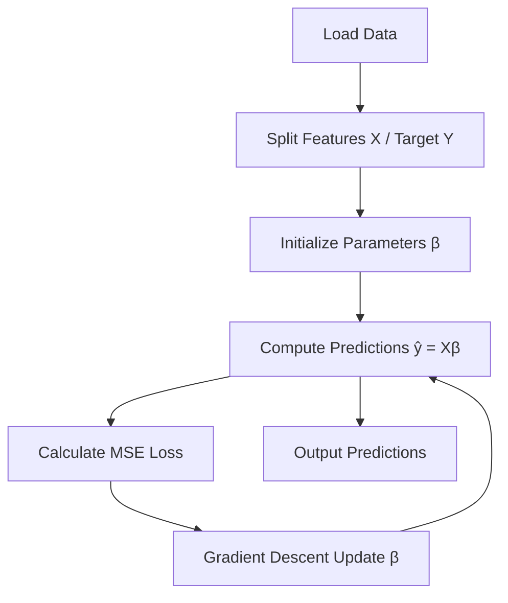
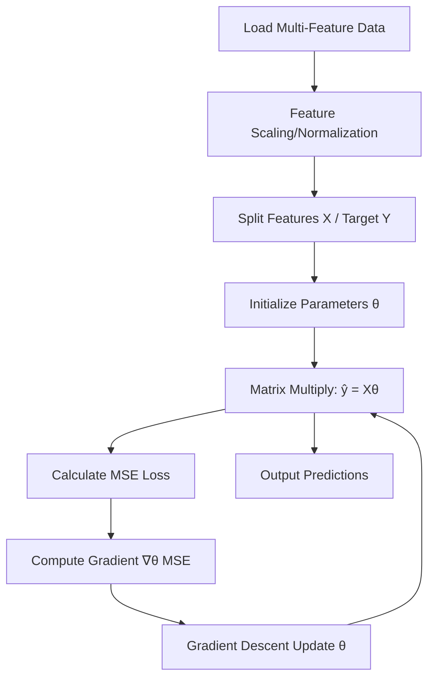
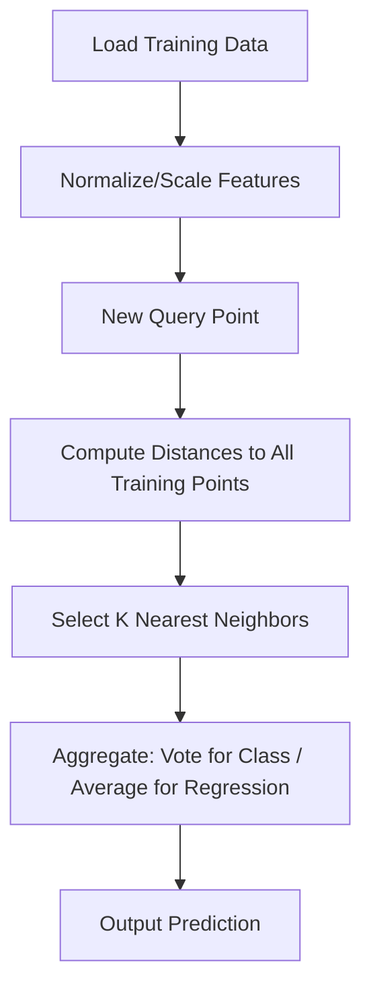
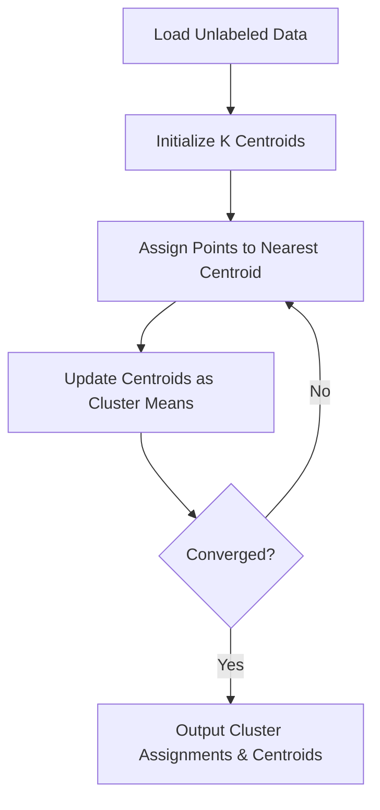
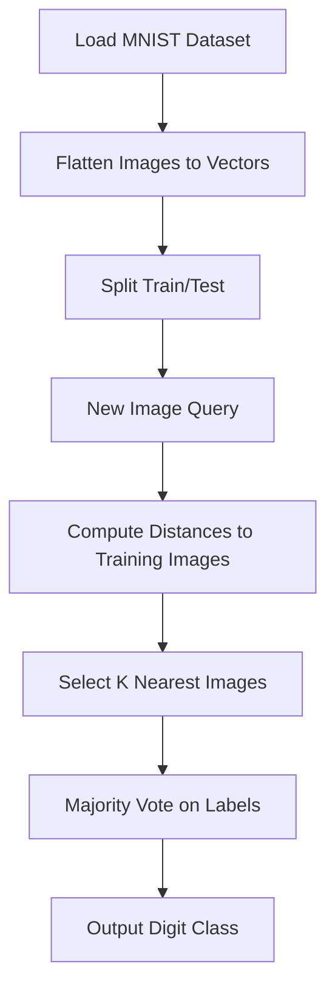
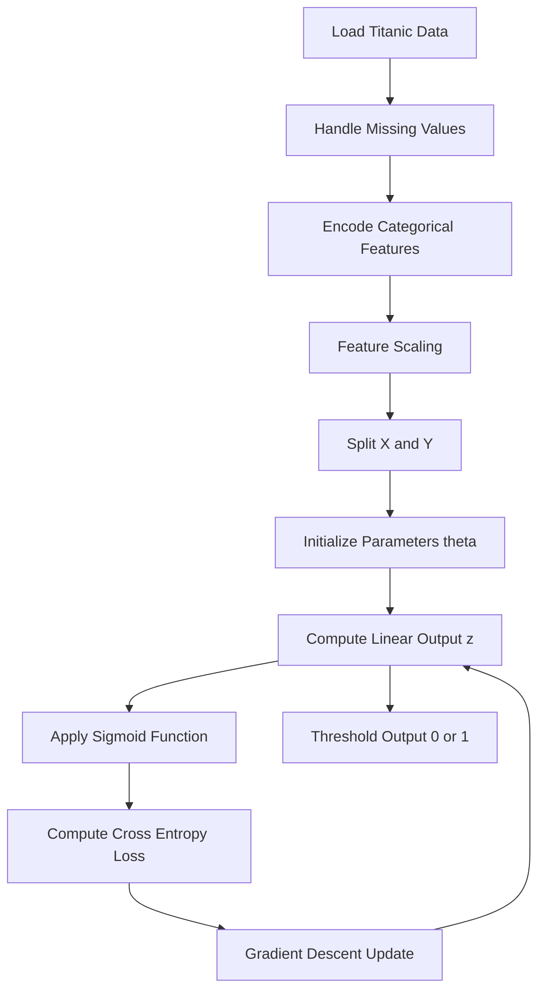

# ML from Scratch

This repository implements core Machine Learning algorithms from scratch using Python and Jupyter Notebooks. It covers foundational concepts like Linear Regression, K-Nearest Neighbors (KNN), K-Means Clustering, KNN on the MNIST dataset, and Logistic Regression. Each implementation includes data loading, model building, training, and evaluation without relying on high-level libraries like scikit-learn (except for data handling where necessary).

The goal is to understand the underlying mathematics and logic behind these algorithms by coding them manually.

## Table of Contents
- [Linear Regression](#linear-regression)
- [Multi-Feature Linear Regression (Boston Dataset)](#multi-feature-linear-regression-boston-dataset)
- [K-Nearest Neighbors (KNN)](#k-nearest-neighbors-knn)
- [K-Means Clustering](#k-means-clustering)
- [KNN on MNIST Dataset](#knn-on-mnist-dataset)
- [Logistic Regression](#logistic-regression)
- [Getting Started](#getting-started)

## Linear Regression

### Theory
Linear Regression is a supervised learning algorithm used for predicting continuous output values based on one or more input features. It assumes a linear relationship between the input features (X) and the output (y), modeled as:

$$y = \beta_0 + \beta_1 x_1 + \beta_2 x_2 + \dots + \beta_n x_n + \epsilon$$

Where:
- $\beta_0$ is the intercept (bias term).
- $\beta_1, \beta_2, \dots, \beta_n$ are the coefficients (weights) for each feature $x_1, x_2, \dots, x_n$.
- $\epsilon$ is the error term.

The model is trained by minimizing the **Mean Squared Error (MSE)** loss function:

$$MSE = \frac{1}{m} \sum_{i=1}^{m} (y_i - \hat{y}_i)^2$$

Where $m$ is the number of samples, $y_i$ is the actual value, and $\hat{y}_i$ is the predicted value.

Optimization is typically done using **Gradient Descent**, which iteratively updates the parameters:

$$\beta_j := \beta_j - \alpha \frac{\partial}{\partial \beta_j} MSE$$

Where $\alpha$ is the learning rate. The partial derivatives are:

$$\frac{\partial}{\partial \beta_j} MSE = -\frac{2}{m} \sum_{i=1}^{m} (y_i - \hat{y}_i) x_{i,j}$$

This implementation uses simple univariate linear regression on salary data.

### Data Flow


**Files:**
- `LinearRegression.ipynb` / `linearregression.py`: Core implementation.
- `SalaryData.ipynb` / `salarydata.py`: Example on salary prediction.
- `Linear_X_Train.csv`, `Linear_Y_Train.csv`: Training data.

## Multi-Feature Linear Regression (Boston Dataset)

### Theory
Extending univariate linear regression, **Multiple Linear Regression** handles multiple input features. The model becomes:

$$y = \beta_0 + \sum_{j=1}^{n} \beta_j x_j + \epsilon$$

Training follows the same principles: MSE minimization via Gradient Descent, but now gradients are computed across all features and the bias term. Matrix notation simplifies this:

Let $X$ be the feature matrix (m samples × n features), $\theta$ the parameter vector (including bias), then:

$$\hat{y} = X \theta$$

$$MSE = \frac{1}{2m} (X\theta - y)^T (X\theta - y)$$

Gradient:

$$\nabla_\theta MSE = \frac{1}{m} X^T (X\theta - y)$$

Update: $\theta := \theta - \alpha \nabla_\theta MSE$

This is applied to the Boston Housing dataset, predicting house prices based on features like crime rate, rooms per dwelling, etc. Normalization (e.g., feature scaling) is crucial for convergence.

### Data Flow


**Files:**
- `MultiFeatureLinear_Reg.ipynb` / `multifeaturelinear_reg.py`: Implementation using Boston dataset.

## K-Nearest Neighbors (KNN)

### Theory
KNN is a **non-parametric, instance-based** supervised learning algorithm for classification or regression. It predicts the output for a new data point by finding the K closest training examples (neighbors) in the feature space and aggregating their outputs.

Distance metric (e.g., Euclidean):

$$d(p, q) = \sqrt{\sum_{i=1}^{n} (p_i - q_i)^2}$$

For classification:
- Majority vote among K neighbors.
- Tie-breaking via distance weighting: $w_i = 1 / d_i$.

For regression:
- Average (or weighted average) of K neighbors' values.

K is chosen via cross-validation; too small K leads to overfitting, too large to underfitting. Preprocessing includes normalization to prevent feature dominance.

This implementation focuses on classification/regression on custom datasets.

### Data Flow


**Files:**
- `KNN.ipynb` / `knn.py`: Core KNN algorithm.
- `xdata.csv`, `ydata.csv`: Sample data for testing.

## K-Means Clustering

### Theory
K-Means is an **unsupervised learning** algorithm for partitioning data into K clusters based on similarity. It minimizes the within-cluster sum of squares (inertia):

$$J = \sum_{i=1}^{K} \sum_{x \in C_i} \| x - \mu_i \|^2$$

Where $C_i$ is the i-th cluster, $\mu_i$ its centroid.

**Algorithm Steps:**
1. Initialize K centroids (randomly or via K-Means++).
2. Assign each point to the nearest centroid (Euclidean distance).
3. Update centroids as the mean of assigned points.
4. Repeat until convergence (no change in assignments or max iterations).

Elbow method determines optimal K by plotting inertia vs. K. Sensitive to initialization; multiple runs recommended.

This is demonstrated on image segmentation (elephant.jpg) and synthetic data.

### Data Flow


**Files:**
- `Kmeans.ipynb` / `kmeans.py`: Implementation.
- `elephant.jpg`: Sample image for clustering.

## KNN on MNIST Dataset

### Theory
MNIST is a benchmark dataset of 70,000 handwritten digits (28x28 grayscale images). Applying KNN here treats it as a multi-class classification problem (digits 0-9).

Each image is flattened to a 784-dimensional vector. KNN classifies by finding K nearest images and voting on their labels. High dimensionality requires dimensionality reduction (e.g., PCA) or efficient indexing (e.g., KD-trees) for speed, but this from-scratch version uses brute-force distance computation.

Accuracy improves with smaller K but risks overfitting; typical accuracy ~95% with K=3-5.

### Data Flow


**Files:**
- `MNIST.ipynb` / `mnist.py`: KNN classifier on MNIST.

## Logistic Regression

### Theory
Logistic Regression is a supervised learning algorithm for binary (or multi-class) classification, predicting the probability of a binary outcome (0 or 1) based on input features. Unlike linear regression, it uses the **sigmoid (logistic) function** to map linear outputs to probabilities between 0 and 1:

$$\sigma(z) = \frac{1}{1 + e^{-z}}$$

Where $z = \beta_0 + \sum_{j=1}^{n} \beta_j x_j$ (linear combination).

The model minimizes the **Binary Cross-Entropy (Log Loss)**:

$$J(\beta) = -\frac{1}{m} \sum_{i=1}^{m} [y_i \log(\hat{y}_i) + (1 - y_i) \log(1 - \hat{y}_i)]$$

Where $\hat{y}_i = \sigma(X_i \beta)$, and optimization uses Gradient Descent or solvers like SAG (Stochastic Average Gradient):

$$\nabla_\beta J = \frac{1}{m} X^T (\hat{y} - y)$$

Predictions are thresholded at 0.5 for binary decisions. This implementation uses the Titanic dataset to predict survival (0: no, 1: yes) based on features like age, sex, class, etc. Preprocessing (handling missing values, encoding, scaling) is essential.

### Data Flow


**Files:**
- `Logistic_Regression.ipynb`: Implementation on Titanic survival prediction.
- `train.csv`: Titanic training dataset.

## Getting Started

### Prerequisites
- Python 3.8+
- Jupyter Notebook
- Libraries: NumPy, Pandas, Matplotlib (for visualization)

### Installation
1. Clone the repo:
   ```
   git clone https://github.com/CodeCraftsmanRohit/MLfromScratch.git
   cd MLfromScratch
   ```
2. Install dependencies:
   ```
   pip install numpy pandas matplotlib scikit-learn  # For data loading only
   ```

### Running the Code
- Open and run Jupyter notebooks directly: `jupyter notebook`
- For scripts: `python filename.py`

### Contributing
Feel free to fork, add more algorithms, or improve implementations!


### License
This Notes is open-source. Contact Rohit😊 for Enquiry and Updates.

---

*Built with ❤️ for learning ML fundamentals.*